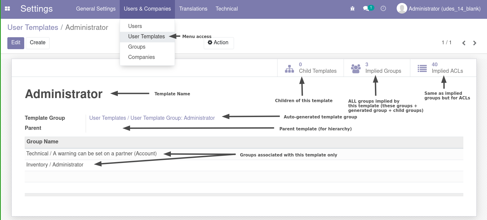
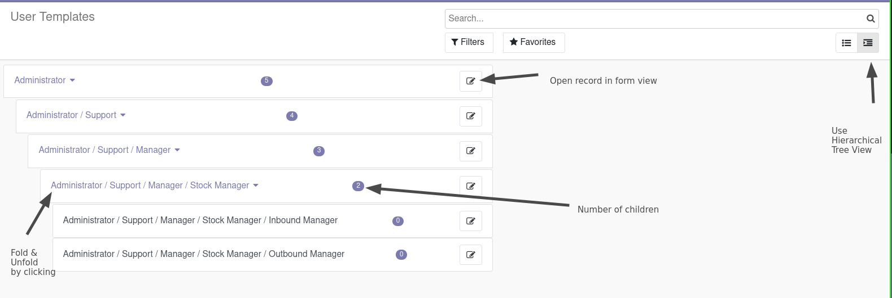

# UDES Permissions
## User Templates
### Overview
Allows users / system to configure a hierarchy of User Templates which have res.groups associated with them.

Parents inherit their descendants groups (and thus, ACLs).

Has one magic field `template_group_id` which will automatically create/delete a user group with the template which allows for easy tuning of ACLs for users using this template.

Name changes back / forth of this template should propagate between the group and template.

Only users with `Manage User Templates` permission will be able to R/W/C/D on this model.

Generated user groups, along with this managing group, will appear under a new category `User Templates` on the user form.

### UI
Form View:

Hierarchical Tree View:

### API
If you are utilizing this model, you should only need to use the following functions instead of directly access the fields on the User Template model.

These examples assume the following hierarchy set up. In [brackets] are the groups attached to that template. Highly simplified.
```
| - Admin [Administration/Settings]
| -- Stock Manager [Inventory/Administrator, Sales/Administrator]
| --- Inbound Stock User [Inventory/User]
| --- Outbound Stock User [Inventory/User, Sales/User]
```

#### def get_template_groups()
Get the usergroups associated with a template family (excluding parent templates) along with the usergroups set under `template_group_id`.

(i.e every group you would need when considering applying a template).

Usage:
```python
UserTemplate = self.env["user.template"]

UserTemplate.search([("name", "=", "Admin")]).get_template_groups().mapped("name")
> [
    "User Template Group: Admin",
    "User Template Group: Stock Manager",
    "User Template Group: Inbound Stock User",
    "User Template Group: Outbound Stock User",
    "Administration/Settings",
    "Inventory/Manager",
    "Sales/Administrator",
    "Inventory/User",
    "Sales/User",
]

UserTemplate.search([("name", "=", "Outbound Stock User")]).get_template_groups().mapped("name")
> [
    "User Template Group: Outbound Stock User",
    "Inventory/User",
    "Sales/User",
]

```
#### def get_template_descendants()
Get the template along with all of its descendants. Useful for determining if a group is in a family.

Usage:
```python
UserTemplate = self.env["user.template"]

UserTemplate.search([("name", "=", "Admin")]).get_template_descendants().mapped("name")
> [
    "Admin",
    "Stock Manager",
    "Inbound Stock User",
    "Outbound Stock User",
]

UserTemplate.search([("name", "=", "Outbound Stock User")]).get_template_descendants().mapped("name")
> [
    "Outbound Stock User,
]


```
