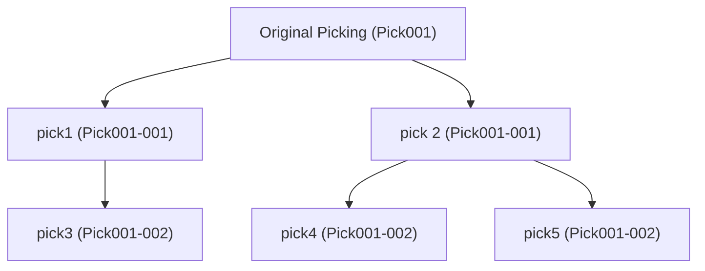

# UDES Stock

## Default settings

- product.product
    - Track visiblity of active field
- product.template
    - Track visiblity of active field
    - Disable name translation
    - Default type stockable
- stock.location
    - Track visiblity of active field
    - Disable name translation
- data/stock_config.xml
    - Batch pickings turned on
    - Delivery Packaging
    - Product variants
    - Lots and serial
    - Display lots serial on the delivery slip
    - Multi-step Route
- data/locations.xml
    - Warehouse → Input / Stock / Output
    - Input → Received
    - Stock → Normal Locations
    - Output → Goods Out Lane / Trailers
- data/routes.xml
    - Goods in → Putaway
    - Pick → Goods Out → Trailer Despatch

## Requires
- udes_common:
  Contains useful helper functions, such as groupby

## Models

In general the functions are designed to be as simple as possible, where they do one thing well. 
One reason why update picking has not been migrated over, as it is just a lot of if statements.

### Common

In common.py we store helper functions used across models that don't need to be bound to the classes in which they are used.

| Method | Description |
|-|-|
| get_next_name | Get the next name in the sequenece via the current sequence or code, used for things like pickings and batches. This is used in stock.picking to enforce backorders have `-001`, `-002` etc appended to the original name rather than a unique name. |

### MixinStockModel (model: mixin.stock.model)
This model is used to include generic functions that are inherited by various models in udes_stock.

| Field Name     | Type          | Description                                                                                                         |
|----------------|---------------|---------------------------------------------------------------------------------------------------------------------|
| MSM_CREATE     | boolean       | Whether it can create a new object which the method is called from, e.g product, group etc. Set to False by default |
| MSM_STR_DOMAIN | tuple(string) | Tuple of strings in which to search for/create the object                                                           |

| Helpers         | Description                                                                                                                                                                                                                                                                                                                |
|-----------------|----------------------------------------------------------------------------------------------------------------------------------------------------------------------------------------------------------------------------------------------------------------------------------------------------------------------------|
| _get_msm_domain | Gets the domain                                                                                                                                                                                                                                                                                                            |
| get_or_create   | Gets an object of the model from the identifier. In case that no results are found, creates a new object of the model depending on the create parameter and the MSM_CREATE setting. If no object is found and create is False the function will raise a Validation Error unless the return_emtpy parameter is set to True. |

### Products (model: product.product)

Products are the actual items we want to handle. These can be car parts, mobile phones or plant pots.

Additional Details:
- Inherits from: mixin.stock.model

| Field Name     | Type          | Description                                                             |
|----------------|---------------|-------------------------------------------------------------------------|
| MSM_STR_DOMAIN | tuple(string) | What get_or_create uses to search for products with                     |
| active         | string        | How the product is tracked in the system. This is used for serial lots. |

### Product Template (model: product.template)

| Field Name          | Description                                     |
|---------------------|-------------------------------------------------|
| active              | Tracking enabled on change                      |
| name                | Disable translation instead of renaming         |
| type                | Enable products to be stockable                 |
| u_speed_category_id | The speed in which the product can be processed |
| u_height            | Product height in metres                        |
| u_length            | Product length in metres                        |
| u_width             | Product width in metres                         |

### Locations (model: stock.location)

The warehouse is made up of various locations for storing stock. There are two main types of locations - stock, and non-stock locations. Stock typically represents all the warehouse storage of products that can be sent to customers. The other locations typically represent transition stages around receiving goods and sending goods out to customers.

Additional Details:
- Additionally Inherits from: mixin.stock.model and mail.thread

| Field Name | Type             | Description                             |
|------------|------------------|-----------------------------------------|
| name       | int              | Disable translation instead of renaming |
| active     | [{stock.quants}] | Add tracking or archiving               |

### Quants (model: stock.quant)

Physical instances of products at a location are modelled as quants. Short of "quantities of stock", these are used to record stock levels are various parts of the warehouse. Using the analogy of object-orientated programming, products = classes, quants = objects.
Note that quants are stored in their unit of measure, so if screws come in boxes of 1000 and we have 5000 in a location,
then we would have `available_quantity = 5`.

Additional Details:
- Change _description to 'Quant'

| Helpers               | Description                                                                                                  |
|-----------------------|--------------------------------------------------------------------------------------------------------------|
| _gather               | Calls default gather function, if quant_ids context variable is set the resulting quants are filtered by id. |
| get_quantity          | Returns the total quantity of the quants in self                                                             |
| get_quantities_by_key | Returns a dictionary with the total quantity per product, mapped by product_id                               |
| create_picking        | Create a picking from Quants                                                                                 |

### Packages (model: stock.quant.package)

Physical packages of products. They can be used to represent parcels sent to customers, a pallet of products sent from a supplier, a tote used to pick products so they can be sent, or any combination of the above.

Additional Details:
- Change _description to "Package"
- Additionally Inherits from: mixin.stock.model

| Field Name | Description             | Value |
|------------|-------------------------|-------|
| MSM_CREATE | Can create new packages | True  |

| Helpers               | Description                                                                                                                                |
|-----------------------|--------------------------------------------------------------------------------------------------------------------------------------------|
| get_quantities_by_key | This function computes the product quantities for the given package grouped by a key                                                       |
| mls_can_fulfil        | Returns mls which the package can fulfil. If the product_qty of the mls is larger than in the package (i.e. in self) the mls will be split |
| has_same_content      | Compare the content of packages with other packages                                                                                        | 
| find_move_lines       | Find move lines related to the package. Expects a singleton package.                                                                       |
| get_reserved_quantity | Returns the quantity in package that is reserved                                                                                           | 
| create_picking        | Create a picking from package                                                                                                              |

### Stock Picking (model: stock.picking)

This is essentially a collection of products that are to be moved from one location to another.

| Field Name              | Type                     | Description                                                                  |
|-------------------------|--------------------------|------------------------------------------------------------------------------|
| sequence                | int                      | Used to order the 'All Operations' kanban view                               |
| u_first_picking_ids     | one2many (stock.picking) | Shows the pickings at the top of the chain                                   |
| u_prev_picking_ids      | one2many (stock.picking) | Shows the previous pickings in the chain                                     |
| u_next_picking_ids      | one2many (stock.picking) | Shows the next pickings in the chain                                         |
| u_created_backorder_ids | one2many (stock.picking) | Shows backorders created from this picking                                   |
| u_quantity_done         | float                    | Sums all done move quantities for the picking (in the UoM of the moves)      |
| u_total_quantity        | float                    | Sums all move quantities for the picking (in the UoM of the moves)           |
| u_has_discrepancies     | boolean                  | Flags when u_quantity_done doesn't match u_total_quantity                    |
| u_num_pallets           | int                      | Sums all unique destination packages found in the picking's move lines       |
| u_is_empty              | Boolean                  | Pickings that are unused after refactoring are empty and ready to be deleted |
| u_date_started          | PreciseDatetime          | Last date when the picking has been assigned (with microseconds, will be needed for events)|
| u_assigned_user_ids     | one2many (res.users)     | Assigned users to the picking, can be more than one if picking type handles multi users    |

| Helpers                   | Description                                                                                                                                                                                                                                                                                                                                       |
|---------------------------|---------------------------------------------------------------------------------------------------------------------------------------------------------------------------------------------------------------------------------------------------------------------------------------------------------------------------------------------------|
| get_empty_locations       | Returns the recordset of locations that are child of the instance dest location and are empty.Expects a singleton instance.                                                                                                                                                                                                                       |
| _get_child_dest_locations | Return the child locations of the instance dest location. Extra domains are added to the child locations search query, when specified. Expects a singleton instance.                                                                                                                                                                              |
| get_move_lines            | Get move lines associated to picking, uses functions in stock_move_line.                                                                                                                                                                                                                                                                          |
| backorder_move_lines     | Checks if a backorder is required, creates one according to _backorder_move_lines if so, else returns an empty record set; neither picking is validated. |
| _backorder_move_lines     | Creates a backorder pick from self for all incomplete work, the original move retains with all completed work, new moves are created for the incomplete wrok.  The original pick is not validated. It should be called from within backorder_move_lines. |
| _requires_backorder       | Checks if a backorder is required by checking if all move lines within a picking are present in mls. Cannot be consolidated with _check_backorder in Odoo core, because it does not take into account any move lines parameter.  |
| _prepare_picking_info     | Prepare the picking_info and products_info, returning the picking_info as a list of pickings, and products_info None or as a list of lists of a dictionary of the product info. This is to allow us to create multiple pickings at once.                                                                                                          |
| _prepare_move             | Return a list of the move details to be used later in creation of the move(s). Note: pickings and products_info should be formatted via _prepare_picking_info. Allows for multiple moves to be created at once.                                                                                                                                   | 
| _create_batch             | Creates a batch                                                                                                                                                                                                                                                                                                                                   |
| create_picking            | Create and return a picking for the given picking_type. For multiple pickings a list of lists of dicts of product_info should be passed, and pickings with the same picking_type and other kwargs are the same. The kwargs are applied to pickings, not moves. If needed, the moves can be created outside of create_pickings with _create_moves. |
| _create_move              | Create and return move(s) for the given move_values. Should be used in conjunction with _prepare_move to obtain move_values                                                                                                                                                                                                                       |
| get_empty_pickings        | Generate batches marked with u_is_empty in a recordset or picking type (if u_auto_unlink_pickings is on)                                                                                                                                                                                                                                          |
| unlink_empty              | Deletes empty pickings generated by get_empty_pickings                                                                                                                                                                                                                                                                                            |
| unassign_users            | Unassigning the user(s) from the pickings from self with optional skip_users                                                                                                                                                                                                                                                                      |

### Picking Type (model: stock.picking.type)

The type of stock.picking can is defined by this type. It can represent a goods in, a putaway, an internal transfer, a pick, a goods out, or any other collection of stock moves the warehouse operators want to model within UDES.

| Field Name                | Type    | Description                                                                                                                              |
|---------------------------|---------|------------------------------------------------------------------------------------------------------------------------------------------|
| u_auto_unlink_empty       | Boolean | Flag to indicate whether to unlink empty picking                                                                                         |
| u_user_scans              | string  | This defines what the user will scan (enum: 'pallet', 'package', 'product').                                                             |
| u_target_storage_format   | string  | This defines how the stock is stored at the end of the stock.picking (enum: 'pallet_products', 'pallet_packages', 'package', 'product'). |
| u_under_receive           | Boolean | If the system is able to receive less than what is expected.                                                                             |
| u_over_receive            | Boolean | If the system is able to receive more than what is expected.                                                                             |
| u_scan_parent_package_end | Boolean | If the system should ask the user to scan a parent package on drop off                                                                   |
| u_multi_users_enabled     | Boolean | Flag to enable multi users processing same picking simultaneously.                                                                       |

| Helpers                       | Description                                          |
|-------------------------------|------------------------------------------------------|
| get_action_picking_tree_draft | Used to enable draft picks in the UI                 |
| can_handle_multiple_users     | Checking if a picking type can handle multiple users |

### Stock Move (model: stock.move)

A move of an item of stock from one location to another.
Note:
* `product_qty`: the quantity of the product in the move in the UoM of the product (computed field)
* `product_uom_qty`: the quantity of the product in the move in the UoM of the move
Example, screws come in a box of 1000. The UoM of the product is 1000.
If you wanted a move to always move 6 boxes at a time, the UoM of the move is 6000.
If you wanted to move 12 boxes in one move, then:
* product_qty = 12
* product_uom_qty = 2
so the full/real/absolute quantity (whatever we refer to the 12000 screws as) is never considered in the move.

When using/creating/splitting moves, we use the UoM of the move. 

| Helpers                   | Description                                                                                                                                                                                                                                      |
|---------------------------|--------------------------------------------------------------------------------------------------------------------------------------------------------------------------------------------------------------------------------------------------|
| get_incomplete_moves | Return all moves in self that are not in state done or cancelled. |
| _unreserve_initial_demand | Override stock default function to keep the old move lines, so there is no need to create them again.|
| split_out_move_lines      | Split sufficient quantity from self to cover move_lines, and attach move_lines to the new move. Return the move that now holds all of move_lines. If self is completely covered by move_lines, it will be removed from its picking and returned. |
| split_out_move      | Split a move into two, the original move retains all work completed (qty_done > 0), the new move contains all work not yet done. |

### Stock Move Line (model: stock.move.line)

A move of a specific, handleable item of stock - such as 5 phones, or 1 car door.

| Field Name        | Description    |
|-------------------|----------------|
| u_picking_type_id | Operation Type |

| Helpers               | Description                                                                                                                                                                                                                                                                                                                                                                    |
|-----------------------|--------------------------------------------------------------------------------------------------------------------------------------------------------------------------------------------------------------------------------------------------------------------------------------------------------------------------------------------------------------------------------|
| get_lines_partially_incomplete        | Return the move lines in self that are partially completed, i.e., 0 < quantity done >= quantity to do. | 
get_lines_incomplete  | Return the move lines in self that are not completed, i.e., quantity done < quantity to do.|
| get_lines_done        | Return the move lines in self that are completed, i.e., quantity done >= quantity to do.                                                                                                                                                                                                                                                                                       |
| move_lines_for_qty    | Return a subset of move lines from self where their sum of quantity to do is equal to parameter quantity. In case that a move line needs to be split, the new move line is also returned (this happens when total quantity in the move lines is greater than quantity parameter). If there is not enough quantity to do in the move lines, also return the remaining quantity. |
| _get_search_domain    | Generate search domain for a given move line.                                                                                                                                                                                                                                                                                                                                  |
| get_quants            | Returns the quants related to move lines in self.                                                                                                                                                                                                                                                                                                                              |
| get_quantities_by_key | This function computes the different product quantities for the given move lines.                                                                                                                                                                                                                                                                                              |
| sort_by_key           | Return the move lines sorted by location and product.                                                                                                                                                                                                                                                                                                                          |
| _round_qty            | Round quantity, rounding method = up.                                                                                                                                                                                                                                                                                                                                          |
| _split                | Splits the move line by a) qty if qty is set and (qty_done == 0 or qty == qty_not_done) b) qty_not_done if qty is not set. As cannot split by qty if some already done!                                                                                                                                                                                                        |

### Stock Warehouse

Additional Details:
- Inherits from: mail.thread

| Field Name                   | Type    | Description                                                              |
|------------------------------|---------|--------------------------------------------------------------------------|
| active                       | Boolean | Track visibility on change                                               |
| u_damaged_location_id        | int     | The location where damaged stock is stored at outside of Stock location. |
| u_good_location_id           | int     | The location where received goods are stored at by mobile client.        |
| u_pi_count_move_picking_type | int     | Picking type used to create PI Count move pickings.                      |

| Helpers           | Description                                                  |
|-------------------|--------------------------------------------------------------|
| get_picking_types | Returns a recordset with the picking_types of the warehouse. |

### Users (model: res.users)
Model used to register users that can access the system in the way has been defined in access rights

| Field Name                       | Type                     | Description                                                              |
|----------------------------------|--------------------------|--------------------------------------------------------------------------|
| u_picking_id                     | many2one (stock.picking) | Transfer that has been assigned to the user                              |
| u_picking_assigned_time  | PreciseDatetime                  | Precise time with microseconds when the user got assigned to the picking |

| Helpers                       | Description                                                  |
|-------------------------------|--------------------------------------------------------------|
| assign_picking_to_users       | Assigning a picking to users                                 |
| _unassign_pickings_from_user  | Unassigning pickings from users                              |

## Addtional Information

### Picking Naming Convention

If a backorder gets created from a picking, then it will either have `-001` appended if the prefix does not exist, else it will cause it to increment by one. How sequencing works is that the suffixed sequences refer to the level in the picking tree, not the nth backorder.

Example:

Ref        | Name       | Orignal | Parent | 1st Gen Children |
-|-|-|-|-|
Pick       | Pick001    | Pick001 |   -    | Pick1, Pick2     |
Pick1      | Pick001-01 | Pick001 | Pick   | Pick3            |
Pick2      | Pick001-01 | Pick001 | Pick   | Pick4, Pick5     |
Pick3      | Pick001-02 | Pick001 | Pick1  |        -         |
Pick4      | Pick001-02 | Pick001 | Pick2  |        -         |
Pick5      | Pick001-02 | Pick001 | Pick2  |        -         |

## Future work:

Check performance: add compound indexes, override orderings, etc.
