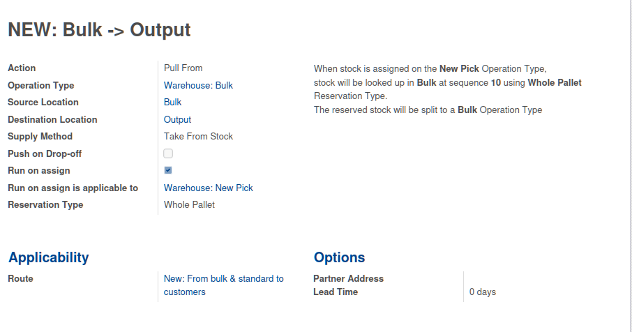
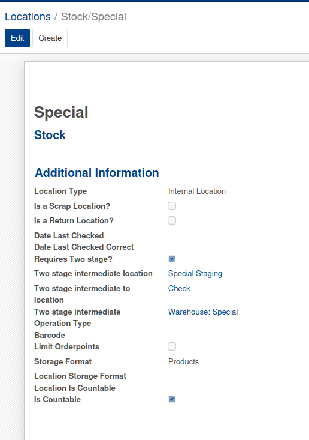

# udes_stock_routing

## Push-on-Drop
TODO

## Run-on-Assign (Split Pick)
Enables more complex reservation strategies configurable on `stock.rule` to be utilised during the stock assignment process. It disables the rule from being used in the procurement running procedure.

This allows for prioritizing certain stock locations or reservation strategies, rather than simply stock in the order of the removal strategy.

Multiple rules for the same applicable picking type can be set up, and the rules will be iterated in sequence (lowest number e.g 1 to highest e.g 10).

The u_run_on_assign boolean field triggers this functionality. Related fields, u_run_on_assign_reservation_type and u_run_on_assign_applicable_to, define the reservation strategy (e.g. whole pallet reservation) and the picking types to which the rule applies.

Reservation strategies:
- `Whole pallet`: Only allows whole pallets to be reserved. Does not work with mixed packages.
- `<Empty>`: No reservation strategy, effectively reserves as per default behaviour.

Removal strategies are preserved when using reservation strategies.

Example configuration:


The `Action` and `Supply Method` have no effect on the rules behaviour.

The sequence is only important if using multiple rules which are applicable to one picking type. It determines the order in which the rules will _gather stock from, and later sequenced rules may not ever need to run, if all of the stock is fulfillable by the first rule.

## Two-stage picking
Enables more complex picking configuration via `stock.location`. The behaviour runs in the same hook as run on assign, but runs afterwards - so the two are compatible with eachother.

When a location (or a parent) is marked as requiring two stage when stock is reserved, an additional hook is run on `_action_assign()` of the moves. If any assignable stock is found, it is split into two pickings which must run in sequence, just like any other chain of pickings.

The first pick will be to move the stock into an intermediate location, before being able to start the second, which will move the stock from the intermediate location to a destination location (configurable), before being able to continue with any chain that existed before the split.

For example, you could have a `Pick` operation type which is destined for `Check`, but when stock is reserved from a particular location, such as `Stock/Special` it requires an additional process to go via `Special` operation type to the `Special Staging` location, before moving to `Check` with the `Check` operation type.

If stock is reserved from `Stock/Normal` then, if the `Normal` location is configured to not require two stage then it will remain on the original picking.



It is possible to configure a hierarchy of settings via the locations hierarchy. The location with a configuration which is the closest parent of the location which stock is reserved from is used to determine how the two stage split should occur.

It is important to consider the storage formats of the intermediate operation types, and also important to consider the location structure to ensure that users are restricted to _only_ being able to scan products from sublocations of the intermediate operation types, whilst still being able to reserve stock from both special locations and normal locations on the original operation type.

An example of a location structure which would make sense is as follows:
```
WH
├── TEST_CHECK
│   ├── Test Check location 01
│   └── Test Check location 02
└── TEST_STOCK
    ├── TEST_SPECIAL (Configured as requiring two stage to go via TEST_SPECIAL_STAGING as an intermediate location)
    │   ├── Test Special Location 01
    │   └── Test Special Location 02
    └── TEST_NORMAL
        ├── Test stock location 01
        ├── Test stock location 02
        ├── Test stock location 03
        ├── Test stock location 04
        └── TEST_SPECIAL_STAGING
            ├── Test Special Staging Location 01
            └── Test Special Staging Location 02
```
